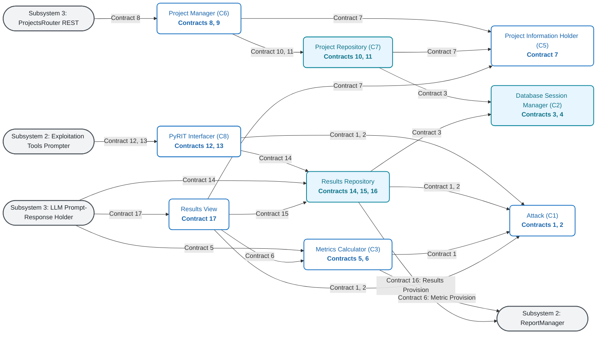

# Subsystem 1: Project & Results Management — Design Documentation (v3.0)

## Subsystem 1 Collaboration Diagram (CS4311 Wirfs-Brock Standard)

---

## Subsystem 1 (Version 3.0) Contract Mapping Table

| Class Name | Global Contracts | Primary Role & Responsibilities | Collaborating Entities |
| :--- | :--- | :--- | :--- |
| **Attack (C1)** | Contract 1, 2 | Attack state, timestamps, and execution progress tracking | Results View, PyRIT Interfacer, Results Repository, Metrics Calculator |
| **Database Session Manager (C2)** | Contract 3, 4 | PostgreSQL connection pool and health checks | Project Repository, Results Repository |
| **Metrics Calculator (C3)** | Contract 5, 6 | Calculates pass/fail, attack ratios, and severity distributions | Attack, Subsystem 3 (Prompt Holder), Results View, Subsystem 2 (ReportManager) |
| **Project Information Holder (C5)** | Contract 7 | Project entity metadata container (id, name, dates, analyst) | Project Manager, Project Repository, Results View |
| **Project Manager (C6)** | Contract 8, 9 | Project creation, open, delete, and XML import lifecycle | Project Repository, Project Info Holder, Subsystem 3 (ProjectsRouter) |
| **Project Repository (C7)** | Contract 10, 11 | PostgreSQL CRUD operations for project records | Database Session Manager, Project Manager, Project Info Holder |
| **PyRIT Interfacer (C8)** | Contract 12, 13 | PyRIT flag configuration and offline assessment execution | Attack, Results Repository, Subsystem 2 (Exploitation Tools Prompter) |
| **Results Repository** | Contract 14, 15, 16 | PostgreSQL persistence for attack records, prompts, and status | Database Session Manager, Attack, PyRIT, Results View, Subsystems 2 & 3 |
| **Results View** | Contract 17 | Displays project summary metrics, attack tables, and visualizations | Attack, Metrics Calculator, Project Info Holder, Results Repo, Subsystem 3 |
